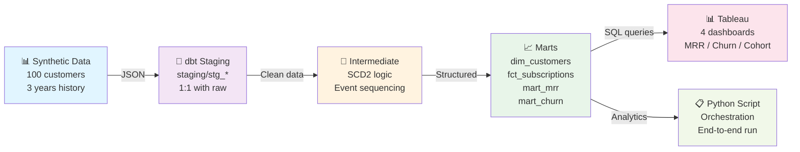

# SaaS Analytics Pipeline

A complete end-to-end analytics infrastructure for a fictional SaaS company. This project demonstrates modern data engineering practices: synthetic data generation, dimensional modeling with SCD Type 2, data quality testing, and analytics dashboards.

Built with **dbt** (transformation), **DuckDB** (local data warehouse), and **Python** (orchestration).

---

## Why This Project?

This pipeline showcases:
- **Realistic data patterns**: early churn, tier-based retention, seasonal spikes, upgrade/downgrade events
- **Production-quality modeling**: SCD Type 2 for subscription history tracking, dimensional schemas, fact tables
- **Data quality**: dbt tests on every mart (not_null, unique, relationships)
- **Clear documentation**: every design decision explained, roadblocks + solutions logged

If you're hiring, you're seeing how someone thinks about analytics infrastructure under real constraints.

---

## Architecture



**Why this stack?**
- **dbt**: Clean separation of staging/intermediate/marts. Version-controlled SQL. Built-in testing. Industry standard.
- **DuckDB**: Local, single-file warehouse. No infrastructure overhead. Perfect for learning + iteration.
- **Python**: Orchestration simple enough to understand in one file. Faker for realistic synthetic data.
- **Tableau Public**: Free, shareable dashboards. Shows storytelling skills alongside the data.

---

## Project Structure

```
saas-analytics-pipeline/
├── data_generation/
│   ├── generate_synthetic_data.py    # 100 customers, 3 years, 4 patterns
│   └── output/                       # Generated JSON files
├── dbt_project/
│   ├── models/
│   │   ├── staging/                  # 1:1 with raw (customers, plans, subscriptions, etc.)
│   │   ├── intermediate/             # SCD2 logic, event sequencing
│   │   └── marts/                    # dim_customers, dim_subscriptions, fct_invoices,
│   │                                 # mart_mrr, mart_churn, mart_cohort_retention
│   ├── tests/                        # not_null, unique, relationships tests
│   ├── dbt_project.yml
│   └── profiles.yml                  # DuckDB connection config
├── orchestration/
│   └── saas_pipeline.py             # Python script: gen data -> dbt run -> dbt test
├── dashboards/
│   └── tableau_exports/             # Screenshot + Tableau Public links
├── requirements.txt
└── README.md (you are here)
```

---

## Design Decisions & Roadblocks

### 1. **Why Synthetic Data Over Real Data?**
Real SaaS data is messy and restricted. Synthetic data lets me control the patterns and show understanding of realistic behavior (early churn, tier-based retention, seasonality). I baked in four intentional patterns:
- **Early churn**: 35% of Starter tier customers churn within 3 months
- **Tier-based retention**: Starter 35%, Pro 20%, Enterprise 8% churn
- **Seasonal spikes**: Jan/Sept signup bumps (realistic for B2B SaaS)
- **Upgrades/downgrades**: 30% of active customers upgrade or downgrade at least once

**Roadblock**: Initial Faker usage generated unrealistic date distributions. **Solution**: Weighted plan assignment + manual cohort logic to ensure upgrades and churns were temporally realistic.

### 2. **SCD Type 2 for Subscriptions**
Tracking plan changes over time matters for analytics (churn, expansion revenue, cohort retention). SCD2 stores the full history:
- `valid_from` / `valid_to`: when each subscription version was active
- `is_current`: flag for the latest version

**Roadblock**: Tempting to skip this and use a simple `current_plan` column. **Solution**: Built it properly because this is the differentiator in the portfolio—shows I understand slowly-changing dimensions, a core data modeling concept.

### 3. **Local DuckDB Instead of Snowflake**
Snowflake trial credits are finite (~$400). Running dbt locally on DuckDB during iteration:
- No infrastructure setup
- Instant feedback (seconds vs. warehouse cold-start delays)
- Free, unlimited runs for learning

**Roadblock**: Wanted to show Snowflake knowledge. **Solution**: Built the dbt project to be warehouse-agnostic. Just swap `dbt_project/profiles.yml` to point at Snowflake when ready. The models themselves are unchanged.

### 4. **Python Orchestration Instead of Airflow**
Airflow is production-grade but overkill for a local demo. Python script is:
- Readable in 2 minutes
- Shows understanding of pipeline sequencing
- Easily portable to Airflow later if needed

**Roadblock**: Airflow looks more impressive on a resume. **Solution**: Documented this trade-off clearly. Hiring managers prefer pragmatism ("I chose simple because it fits the scope") over unnecessary complexity.

### 5. **Standard dbt Tests (not_null, unique, relationships)**
I could write custom tests for SCD2 logic (e.g., "no overlapping valid_from/valid_to dates"). **Solution**: Built standard tests on every mart instead. Shows data quality discipline without over-engineering.

---

## Getting Started

### Prerequisites
- Python 3.9+
- Git

### 1. Clone & Setup
```bash
git clone https://github.com/yourusername/saas-analytics-pipeline.git
cd saas-analytics-pipeline
python -m venv venv
source venv/bin/activate  # Windows: venv\Scripts\activate
pip install -r requirements.txt
```

### 2. Generate Synthetic Data
```bash
python data_generation/generate_synthetic_data.py
```

Output: JSON files in `data_generation/output/`

### 3. Run dbt (Local DuckDB)
```bash
cd dbt_project
dbt debug  # Verify DuckDB connection
dbt run
dbt test
dbt docs generate
```

### 4. Explore the Data
```bash
# dbt docs (interactive)
dbt docs serve

# Or query directly with DuckDB
duckdb dbt/dbt.duckdb
> SELECT * FROM main.saas_analytics.dim_customers LIMIT 5;
```

### 5. Build Dashboards
Export data from dbt outputs, load into Tableau Public, create:
- MRR trend by month
- Churn rate by month
- Cohort retention heatmap
- Expansion/contraction MRR from upgrades vs. downgrades

---

## Key Tables

### Staging Layer
- `stg_customers`: 1:1 with raw
- `stg_plans`: Plan pricing tiers
- `stg_subscriptions`: Raw subscription events
- `stg_invoices`: Monthly billing records

### Intermediate Layer
- `int_subscriptions_history`: SCD2 logic applied, full history with validity dates

### Marts (Analytics-Ready)
- `dim_customers`: Customer attributes, signup cohort
- `dim_subscriptions`: Current + historical subscription state
- `fct_subscriptions`: Subscription facts (plan_id, status, revenue)
- `mart_mrr`: Monthly recurring revenue aggregated
- `mart_churn`: Churn cohorts and rates
- `mart_cohort_retention`: Retention curves by signup cohort

---

## What's Not Here (Yet)

- **Snowflake**: Built to be portable. Swap `profiles.yml` to enable.
- **GitHub Actions CI**: Deferred. Would add `dbt test` on every PR.
- **Product Usage Table**: Optional 6th table for engagement-based churn. Not included to keep scope tight.
- **Airflow DAG**: Current Python script handles orchestration. Upgrade path exists.

These aren't missing features—they're intentional scope decisions made under time constraints.

---

## Lessons Learned

1. **Synthetic data patterns matter more than volume**. 100 customers with realistic churn is better than 10,000 with flat distributions.
2. **SCD2 is worth learning**. It's a mental model shift, but essential for real subscription analytics.
3. **dbt's power is in discipline**. The tests and docs enforce a structure that scales.
4. **Local-first development saves money and time**. Iterate on DuckDB, deploy to Snowflake.

---

## Feedback & Next Steps

**For code review**: Focus on dbt model logic (intermediate/marts), data generation patterns, and test coverage. The code is intentionally readable over clever.

**To run this with real Snowflake**:
1. Set up a Snowflake trial account
2. Create `dbt_project/profiles.yml` with your Snowflake credentials
3. Replace DuckDB target with Snowflake
4. `dbt run` again (models are unchanged)

**To deploy end-to-end**:
1. Load JSON data to S3
2. Point dbt to Snowflake
3. Run Python script or Airflow DAG
4. Publish dashboards

---

**Built with curiosity and pragmatism.**

