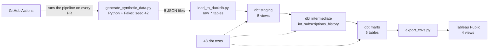

# SaaS Subscription Analytics Pipeline

[](https://github.com/thaenandarhtet-iris/saas-analytics-pipeline/actions/workflows/dbt_ci.yml)
[](LICENSE)

An end-to-end analytics engineering project that models subscription revenue for a fictional B2B SaaS company. The pipeline generates three years of synthetic subscription data, transforms it with dbt on DuckDB into tested dimensional and reporting models, and publishes MRR, churn and cohort retention metrics to a Tableau Public dashboard. A single command runs the complete workflow.

**Live dashboard:** [Tableau Public](https://public.tableau.com/app/profile/iris.htet/viz/saas-analytics-dashboard/Dashboard)


**Note on the data.** All data in this project is synthetic. The figures in this document describe the output of the project's data generator and are not findings about a real business. Churn behavior, plan mix, seasonality and plan changes are configured assumptions, which makes it possible to validate the models' outputs against known inputs.

## Overview

| | |
|---|---|
| Source data | 100 customers, 137 subscription versions, 172 events and 1,559 invoices (1,971 raw rows), September 2023 to September 2026 |
| dbt project | 12 models (5 staging, 1 intermediate, 6 marts) and 48 tests, all passing |
| Execution | `python orchestration/saas_pipeline.py` runs generation, load, `dbt run`, `dbt test` and export |
| Continuous integration | GitHub Actions runs the same script on every pull request and every push to `main` |
| Dashboard | Four views: MRR trend, MRR movement, monthly churn and cohort retention heatmap |

## Results (as of September 2026)

| Metric | Value |
|---|---|
| Monthly recurring revenue | $8,555 from 65 active customers (annualized run rate of $102,660; average of about $132 per customer per month) |
| MRR growth | $4,695 (Sep 2024), $6,835 (Sep 2025), $8,555 (Sep 2026): +45.6%, then +25.2% year over year |
| Customer churn | 35 of 100 customers (35%) |
| Early-life churn | 17 of 35 cancellations (48.6%) occurred within 90 days of signup. Monthly churn was 6.3% during the first 90 days and 1.5% thereafter, approximately 4.3 times higher |
| Churn by starting plan | Starter 40.0% (18 of 45), Pro 31.7% (13 of 41), Enterprise 28.6% (4 of 14) |
| 12-month logo retention | 74.0% (54 of 73 customers with at least 12 months of history) |
| Net / gross revenue retention | 91.4% / 76.5% (September 2025 to September 2026; 55 customers; $6,835 starting MRR; $6,246 retained from the same customers) |
| Plan changes | 27 customers changed plans at least once: 22 upgrades and 15 downgrades |
| Revenue concentration | Enterprise: 19 of 65 active customers (29%) and $5,681 of MRR (66.4%). Starter: 24 customers (37%) and $696 of MRR (8.1%) |
| Billing | Of 1,559 invoices totaling $193,121: 93.5% paid, 4.9% failed, 1.7% refunded |
| Signup seasonality | 14 signups in January and 11 in September, compared with an average of 7.5 per month in the other ten months (October also had 11) |

MRR reconciles exactly over the full three-year period: **+$9,393 new, +$3,520 expansion, -$1,570 contraction and -$2,788 churned, for an ending MRR of $8,555.** Expansion MRR exceeded contraction MRR by a factor of 2.2.

**Interpretation notes.** With 100 customers, small groups have an outsized effect on percentages. The Enterprise churn rate rests on 14 customers, so the ordering Starter > Pro > Enterprise holds, but the gap between Pro and Enterprise is too small, on samples this size, to be read as a real difference. Because the churn assumptions are configured in the generator, the churn results demonstrate that the pipeline recovers the patterns built into the data. They are not empirical findings about SaaS businesses.

## Architecture



`orchestration/saas_pipeline.py` executes these steps in order and halts at the first failure.

## Data model

Five raw tables are loaded one-to-one into DuckDB with a `raw_` prefix:

| Table | Rows | Description |
|---|---|---|
| customers | 100 | Company, industry, region, size band and signup date |
| plans | 3 | Starter ($29), Pro ($99) and Enterprise ($299) per month |
| subscriptions | 137 | **Slowly changing dimension, Type 2.** One row per plan period, with `valid_from`, `valid_to` and `is_current` |
| subscription_events | 172 | 100 signups, 22 upgrades, 15 downgrades and 35 cancellations |
| invoices | 1,559 | Monthly invoices with paid, failed or refunded status |

The 137 subscription rows consist of 100 initial versions and 37 plan changes. A version is live on a given date when `valid_from <= date < valid_to`, so exactly one version applies on the day of a change. In this model, `subscription_id` identifies a version rather than a customer, and `status` describes how a version ended: `active` for a version that was replaced or remains open, and `canceled` for the final version of a churned customer.

## Synthetic data generation

`generate_synthetic_data.py` simulates each customer month by month using a fixed seed, so every run produces identical data.

- **Plan mix at signup:** 50% Starter, 35% Pro, 15% Enterprise.
- **Churn:** a monthly probability by plan (Starter 2.5%, Pro 1.5%, Enterprise 0.5%), multiplied by 3 during a customer's first three months.
- **Plan changes:** beginning in month 2, Starter and Pro customers may upgrade (2.5% and 1.5% per month respectively), and Pro and Enterprise customers may downgrade (2% per month).
- **Seasonality:** signup dates are weighted 3.0x for January and 2.5x for September.
- **Billing:** one invoice per month for each subscription version. Invoice outcomes are 93% paid, 5% failed and 2% refunded. A plan change begins a new billing cycle without proration.

## dbt models

| Layer | Model | Purpose |
|---|---|---|
| Staging | `stg_customers`, `stg_plans`, `stg_subscriptions`, `stg_subscription_events`, `stg_invoices` | Views mapped one-to-one to the raw tables |
| Intermediate | `int_subscriptions_history` | SCD2 versions joined to plan name and price; the base for all MRR calculations |
| Marts | `dim_customers` | Customer attributes, signup cohort month and active or churned status |
| | `fct_invoices` | Invoices enriched with customer and plan context |
| | `mart_mrr` | MRR at each month end, by plan and region |
| | `mart_mrr_movements` | Month-over-month bridge of new, expansion, contraction and churned MRR |
| | `mart_churn` | Cancellations by month and plan, with days from signup to cancellation |
| | `mart_cohort_retention` | Active customers by signup cohort and months since signup |

Key modeling logic:

- **MRR is a month-end snapshot.** A month spine (September 2023 to September 2026) is joined to the SCD2 versions, and each customer is valued at the price of the version that is live on the last day of the month.
- **MRR movements compare each customer's MRR with the prior month.** A change from zero to a positive amount is new, an increase is expansion, a decrease with continued payment is contraction, and a change to zero is churn.
- **Cohort retention treats a customer as active in a month if any of their versions was live at some point in that month.** The model builds the full cohort-by-age grid (35 monthly cohorts and 691 cohort-month cells) and fills gaps with 0, so a cohort that loses all of its customers reports 0% rather than a blank cell. The dashboard heatmap displays the first 12 months.

## Testing and data quality

All 48 tests pass. Coverage includes uniqueness and not-null checks on every key, `relationships` checks between the staging layer, the intermediate model and the marts, `accepted_values` checks on status, event type and plan, and not-null checks on every mart.

A custom test, `tests/assert_mrr_reconciles.sql`, fails if either of the following conditions is false for any month:

1. New, expansion, contraction and churned MRR sum to net new MRR.
2. Ending MRR in `mart_mrr_movements` equals the total of `mart_mrr`.

Because the MRR bridge and the MRR snapshot are computed by separate models, this test provides an independent reconciliation of the two.

## Engineering notes: issues and resolutions

| Issue | Root cause | Resolution |
|---|---|---|
| `pip install` failed while building `pyarrow` | No prebuilt wheel for Python 3.13, and the source build requires `pkg_resources` | Removed the dependency, which the project did not use |
| `dbt debug` succeeded, then dbt crashed with `MessageToJson() got an unexpected keyword argument` | protobuf 5 is incompatible with dbt-core 1.7 | Pinned `protobuf>=4.25,<5` |
| dbt could not open the database | The profile path was a placeholder, `[dbt_project_dir]/dbt.duckdb` | Replaced it with the relative path `dbt.duckdb` |
| `Catalog "main" does not exist`, followed by `Table ... does not exist` | `database: main` was set on the source, but DuckDB names the catalog after the database file. The loader also created `raw_*` tables while the sources referenced unprefixed names | Removed the `database` override and renamed the sources to `raw_*` |
| `dim_customers` failed its uniqueness test with 100 duplicates, then labeled all 100 customers as churned | Events are keyed by `subscription_id` rather than `customer_id`, so the churn lookup must go through subscriptions. The 100-of-100 result also passed the test suite | Joined through `stg_subscriptions` and rebuilt with `--full-refresh`, producing a plausible split. Category breakdowns are now reviewed in addition to test results |
| The built database and dbt's user file were committed | Missing `.gitignore` entries | Added the entries and removed the files from tracking with `git rm --cached` |
| MRR rose and then fell to zero, and the retention heatmap showed a full month 0 with almost nothing afterward | The marts counted a customer only in the month a subscription row began. The generator also produced future-dated events, a "downgrade" that could leave the plan unchanged, and no seasonality | Rebuilt the marts on a month spine with month-end snapshots, rewrote the generator as a monthly simulation, and added the reconciliation test |
| Tableau lost its data connections | Tableau attempted to relate unrelated CSV files, after which the workbook failed to connect | Rebuilt the workbook with each CSV as a separate data source |
| The MRR chart's axis extended to 40K although actual MRR was $8.6K | Grouping by year caused Tableau to sum twelve monthly snapshots | Switched to the exact month. A snapshot should never be summed across time |
| The CI workflow would have failed on its first run | It referenced a nonexistent `--target ci` and did not generate any data | Changed CI to run the same script used locally. The script was verified in a fresh Python 3.11 environment with no existing database (12 models, 48 tests, all passing), and the first run on GitHub also passed |
| The heatmap showed blank cells where a cohort had lost every customer, and its color scale ended at 33% | The mart wrote a row for a month only when at least one customer remained active, so 0% never appeared. Identified during review of the dashboard screenshot | Built the full cohort-by-age grid and filled missing cells with 0, adding 26 cells across three single-customer cohorts (Nov 2024, Feb 2025 and Apr 2026) |

## Running the project

```bash
git clone https://github.com/thaenandarhtet-iris/saas-analytics-pipeline.git
cd saas-analytics-pipeline
python3.11 -m venv venv
source venv/bin/activate
pip install -r requirements.txt
python orchestration/saas_pipeline.py
```

The project was tested on Python 3.11 (in a clean environment) and Python 3.13. dbt 1.7 did not run on Python 3.14 in testing.

To run the steps individually:

```bash
python data_generation/generate_synthetic_data.py
python ingestion/load_to_duckdb.py
cd dbt_project && dbt run --full-refresh && dbt test
cd .. && python dashboards/export_csvs.py
```

## Repository structure

```
saas-analytics-pipeline/
├── data_generation/generate_synthetic_data.py
├── ingestion/load_to_duckdb.py
├── dbt_project/
│   ├── models/
│   │   ├── staging/            5 views
│   │   ├── intermediate/       int_subscriptions_history
│   │   ├── marts/              6 tables
│   │   └── schema.yml          sources, tests and column descriptions
│   ├── tests/assert_mrr_reconciles.sql
│   ├── dbt_project.yml
│   └── profiles.yml            local DuckDB
├── orchestration/saas_pipeline.py
├── dashboards/
│   ├── export_csvs.py
│   ├── screenshots/
│   └── tableau_public_link.md
├── .github/workflows/dbt_ci.yml
└── requirements.txt
```

## Scope and limitations

- **S3, Snowflake and Airflow are not implemented.** The warehouse is DuckDB, and `orchestration/saas_pipeline.py` executes the steps in the order an Airflow DAG would. Moving to Snowflake would require the `dbt-snowflake` adapter, an additional profile target, and a loader that uses a Snowflake stage with `COPY INTO`. It is not a configuration-only change, because the month spine relies on DuckDB's `generate_series` and the models use `date_diff`, both of which need Snowflake equivalents.
- **Reactivations and paused subscriptions are not modeled.** The generator does not produce them, so those event types and statuses are unused.
- **Product usage data is not included.** All churn in this project is billing-based.
- **Proration and failed-payment handling are out of scope.** MRR is the contracted plan price, so a failed invoice does not reduce MRR.
