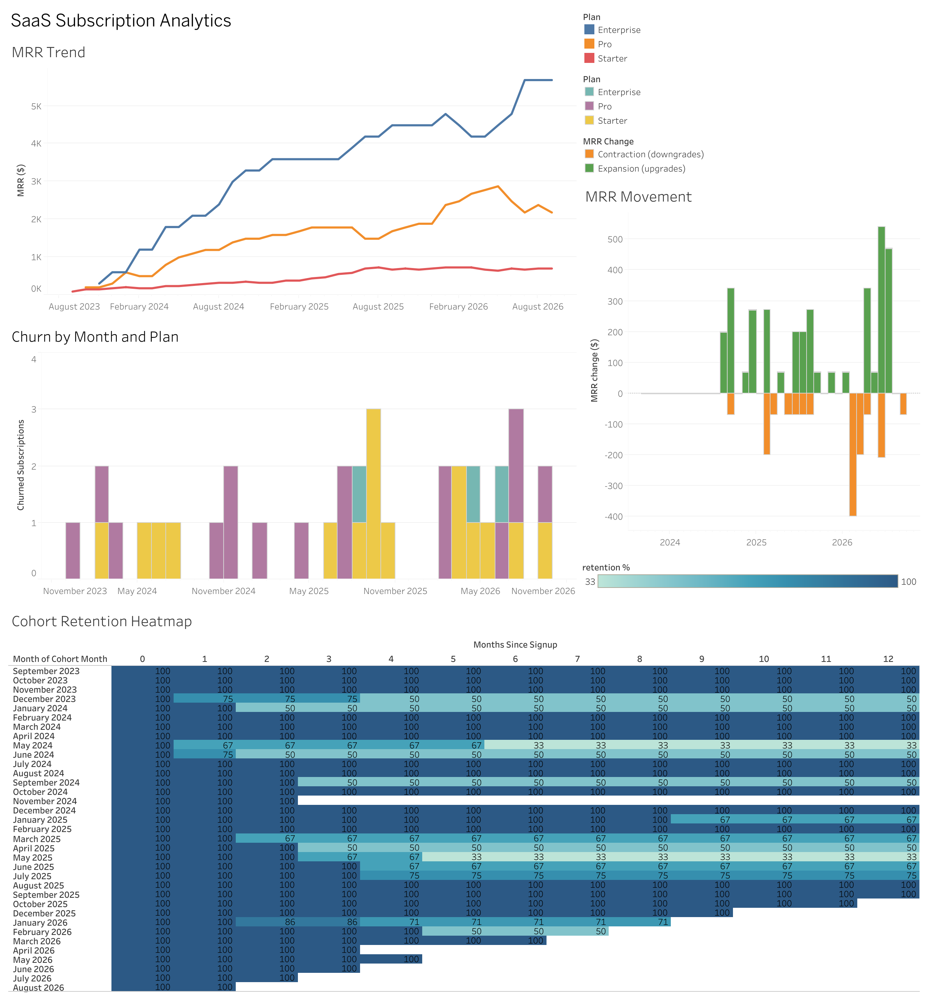
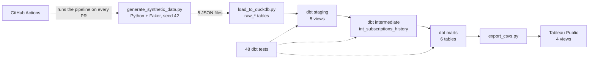

# SaaS Subscription Analytics Pipeline

An end-to-end analytics project. I generated three years of subscription data for a fictional B2B SaaS company, modeled it with dbt on DuckDB, and reported MRR, churn and cohort retention in a Tableau Public dashboard. One command runs the whole thing.

**Live dashboard:** [Tableau Public](https://public.tableau.com/app/profile/iris.htet/viz/saas-analytics-dashboard/Dashboard)



The data is synthetic, so every number below describes what my generator produced, not a real business. I built the patterns in on purpose (early churn, cheaper plans churn more, January and September signup spikes, upgrades and downgrades) so the models had something to find and the SCD2 table had real history to track.

## At a glance

| | |
|---|---|
| Source data | 100 customers, 137 subscription versions, 172 events, 1,559 invoices (1,971 raw rows), Sep 2023 to Sep 2026 |
| dbt project | 12 models (5 staging, 1 intermediate, 6 marts) and 48 tests, all passing |
| Run it | `python orchestration/saas_pipeline.py` (generate, load, `dbt run`, `dbt test`, export) |
| CI | GitHub Actions runs the same script on every pull request |
| Dashboard | 4 views: MRR trend, MRR movement, monthly churn, cohort retention heatmap |

## What the data says (as of Sep 2026)

| Metric | Value |
|---|---|
| MRR | $8,555 from 65 active customers (ARR run-rate $102,660, about $132 per customer per month) |
| MRR growth | $4,695 (Sep 2024) to $6,835 (Sep 2025) to $8,555 (Sep 2026): +45.6%, then +25.2% |
| Customers churned | 35 of 100 (35%) |
| Early churn | 17 of the 35 cancellations (48.6%) came in the first 90 days. Monthly churn was 6.3% in the first 90 days and 1.5% afterward, about 4.3x higher |
| Churn by starting plan | Starter 40.0% (18 of 45), Pro 31.7% (13 of 41), Enterprise 28.6% (4 of 14) |
| 12-month logo retention | 74.0% (54 of the 73 customers with at least 12 months of history) |
| Net / gross revenue retention | 91.4% / 76.5% (55 customers active in Sep 2025, $6,835 starting MRR, $6,246 from the same customers a year later) |
| Plan changes | 27 customers changed plan at least once: 22 upgrades and 15 downgrades |
| Revenue concentration | Enterprise is 19 of 65 active customers (29%) and $5,681 of MRR (66.4%). Starter is 24 customers (37%) and $696 (8.1%) |
| Billing | 93.5% of invoices paid, 4.9% failed, 1.7% refunded, out of $193,121 billed |
| Signups | January 14 and September 11, against 7.5 a month in the other ten months (October also had 11) |

MRR over the full three years reconciles exactly: **+$9,393 new, +$3,520 expansion, -$1,570 contraction, -$2,788 churned = $8,555 ending MRR.** Expansion outweighed contraction 2.2 to 1.

Two caveats before reading anything into these. With 100 customers, small groups swing the percentages, and the Enterprise churn rate rests on 14 customers, so the ordering Starter > Pro > Enterprise holds but the gap between Pro and Enterprise is not meaningful. And because I chose the churn assumptions myself, the churn figures show the pipeline recovering the patterns I put in, not a discovery about SaaS businesses.

## Architecture



`orchestration/saas_pipeline.py` runs those steps in order and stops at the first failure.

## Data model

Five raw tables, loaded 1:1 into DuckDB as `raw_*`:

| Table | Rows | Notes |
|---|---|---|
| customers | 100 | company, industry, region, size band, signup date |
| plans | 3 | Starter $29, Pro $99, Enterprise $299 a month |
| subscriptions | 137 | **SCD Type 2.** One row per plan period, with `valid_from`, `valid_to`, `is_current` |
| subscription_events | 172 | 100 signups, 22 upgrades, 15 downgrades, 35 cancels |
| invoices | 1,559 | monthly, paid / failed / refunded |

The 137 subscription rows are 100 initial versions plus 37 plan changes. A version is live on a date when `valid_from <= date < valid_to`, so on the day of a change exactly one version applies. In this model `subscription_id` identifies a version rather than a customer, and `status` says how the version ended: `active` for a version that was replaced or is still open, `canceled` for a churned customer's last version.

## How the synthetic data works

`generate_synthetic_data.py` simulates each customer month by month with a fixed seed, so the same command gives the same data every time.

- **Plan mix at signup:** 50% Starter, 35% Pro, 15% Enterprise.
- **Churn:** a monthly chance per plan (Starter 2.5%, Pro 1.5%, Enterprise 0.5%), multiplied by 3 during a customer's first three months.
- **Plan changes:** from month 2, Starter and Pro customers can upgrade (2.5% and 1.5% a month), and Pro and Enterprise customers can downgrade (2% a month).
- **Seasonality:** signup dates are weighted 3.0x for January and 2.5x for September.
- **Billing:** one invoice per month for each version. Invoice outcomes are 93% paid, 5% failed, 2% refunded. A plan change starts a new billing cycle with no proration.

## The dbt layers

| Layer | Model | What it does |
|---|---|---|
| Staging | `stg_customers`, `stg_plans`, `stg_subscriptions`, `stg_subscription_events`, `stg_invoices` | Views, 1:1 with the raw tables |
| Intermediate | `int_subscriptions_history` | SCD2 versions joined to plan name and price. Every MRR calculation reads from here |
| Marts | `dim_customers` | Customer attributes, signup cohort month, active or churned |
| | `fct_invoices` | Invoices with customer and plan context |
| | `mart_mrr` | MRR at each month end, by plan and region |
| | `mart_mrr_movements` | Month-by-month bridge: new, expansion, contraction, churned MRR |
| | `mart_churn` | Cancellations by month and plan, with days from signup to cancel |
| | `mart_cohort_retention` | Customers still active, by signup cohort and months since signup |

How the trickier ones work:

- **MRR is a month-end snapshot.** A month spine (Sep 2023 to Sep 2026) is joined to the SCD2 versions, and each customer counts at the price of whichever version is live on the last day of the month.
- **Movements compare each customer's MRR to the month before.** From nothing to something is new. Up is expansion. Down but still paying is contraction. To zero is churned.
- **Cohort retention uses the same live-version rule.** It has 35 monthly cohorts and 665 cohort-month cells, and the heatmap is limited to the first 12 months.

## Testing

All 48 tests pass. They cover uniqueness and not-null on every key, `relationships` between staging, the intermediate model and the marts, `accepted_values` on status, event type and plan, and not-null checks on every mart.

There is also one custom test, `tests/assert_mrr_reconciles.sql`, that fails if either of these is ever false for any month:

1. New + expansion + contraction + churned MRR equals net new MRR.
2. Ending MRR in `mart_mrr_movements` equals the sum of `mart_mrr`.

That test is the reason I trust the MRR chart, since the bridge and the snapshot are computed by different models and have to agree to the dollar.

## What broke and how I fixed it

| What happened | Cause | Fix |
|---|---|---|
| `pip install` failed building `pyarrow` | No wheel for Python 3.13, and the source build needs `pkg_resources` | Nothing in the project used it, so I removed it |
| `dbt debug` said OK, then crashed with `MessageToJson() got an unexpected keyword argument` | protobuf 5 is incompatible with dbt-core 1.7 | Pinned `protobuf>=4.25,<5` |
| dbt could not open the database | The profile path was still a placeholder, `[dbt_project_dir]/dbt.duckdb` | Used a relative path, `dbt.duckdb` |
| `Catalog "main" does not exist`, then `Table ... does not exist` | I set `database: main` on the source, but DuckDB names the catalog after the file. My loader also created `raw_*` tables while the sources looked for unprefixed names | Removed the `database` override and named the sources `raw_*` to match |
| `dim_customers` failed its uniqueness test with 100 duplicates, then labelled all 100 customers as churned | Events are keyed by `subscription_id`, not `customer_id`, so the churn lookup had to go through subscriptions. The 100-of-100 result also slipped past the tests | Joined through `stg_subscriptions` and rebuilt with `--full-refresh`, which gave a plausible split. I now check breakdowns by eye as well as by test |
| Built database and dbt's user file were committed | Missing `.gitignore` entries | Ignored them and ran `git rm --cached` |
| MRR climbed then fell to zero, and the retention heatmap had a full month 0 and almost nothing after | My marts counted a customer only in the month a subscription row started. The generator also had future-dated events, a "downgrade" that could keep the same plan, and no seasonality | Rebuilt the marts on a month spine with month-end snapshots. Rewrote the generator as a monthly simulation. Added the reconciliation test |
| Tableau lost its data connections | Tableau tried to relate the unrelated CSVs, and the workbook then failed to connect | Rebuilt the workbook with each CSV as its own data source |
| The MRR chart's axis ran to 40K when real MRR was $8.6K | Grouping by year made Tableau add up twelve monthly snapshots | Used the exact month. A snapshot is never summed across time |
| CI workflow would have failed on its first run | It called a `--target ci` that does not exist, and it never generated any data | Made CI run the same script I run locally. I ran that script in a fresh Python 3.11 environment with no database (12 models, 48 tests, all passing) |

## Run it

```bash
git clone https://github.com/thaenandarhtet-iris/saas-analytics-pipeline.git
cd saas-analytics-pipeline
python3.11 -m venv venv
source venv/bin/activate
pip install -r requirements.txt
python orchestration/saas_pipeline.py
```

I tested this on Python 3.11 (a clean environment) and 3.13. dbt 1.7 did not run for me on Python 3.14.

To run the steps by hand:

```bash
python data_generation/generate_synthetic_data.py
python ingestion/load_to_duckdb.py
cd dbt_project && dbt run --full-refresh && dbt test
cd .. && python dashboards/export_csvs.py
```

## Repo layout

```
saas-analytics-pipeline/
├── data_generation/generate_synthetic_data.py
├── ingestion/load_to_duckdb.py
├── dbt_project/
│   ├── models/
│   │   ├── staging/            5 views
│   │   ├── intermediate/       int_subscriptions_history
│   │   ├── marts/              6 tables
│   │   └── schema.yml          sources, tests, column descriptions
│   ├── tests/assert_mrr_reconciles.sql
│   ├── dbt_project.yml
│   └── profiles.yml            local DuckDB
├── orchestration/saas_pipeline.py
├── dashboards/
│   ├── export_csvs.py
│   ├── screenshots/
│   └── tableau_public_link.md
├── .github/workflows/dbt_ci.yml
└── requirements.txt
```

## Known gaps and what I did not build

- **Zero-retention cells are blank in the heatmap.** `mart_cohort_retention` only writes a row for a month when at least one customer from the cohort is still active. Two single-customer cohorts (Nov 2024 and Apr 2026) lost their only customer, so their later cells show as blank instead of 0%, and the lowest value on the color scale is 33% rather than 0%. The fix is to build the full cohort-by-age grid and fill missing cells with 0.
- **S3, Snowflake and Airflow.** I do not have AWS or Snowflake accounts, so the warehouse is DuckDB and `orchestration/saas_pipeline.py` runs the steps in the order an Airflow DAG would. Moving to Snowflake means switching to the `dbt-snowflake` adapter, adding a target, and replacing the loader with an S3 stage plus `COPY INTO`. It is not a pure config change, because the month spine uses DuckDB's `generate_series` and I use `date_diff`, both of which need a Snowflake equivalent.
- **Reactivations and paused subscriptions.** The generator does not produce them, so those event types and statuses are unused.
- **Product usage data.** All churn here is billing-based.
- **Proration and failed-payment handling.** MRR is the contracted plan price, so a failed invoice does not reduce MRR.
